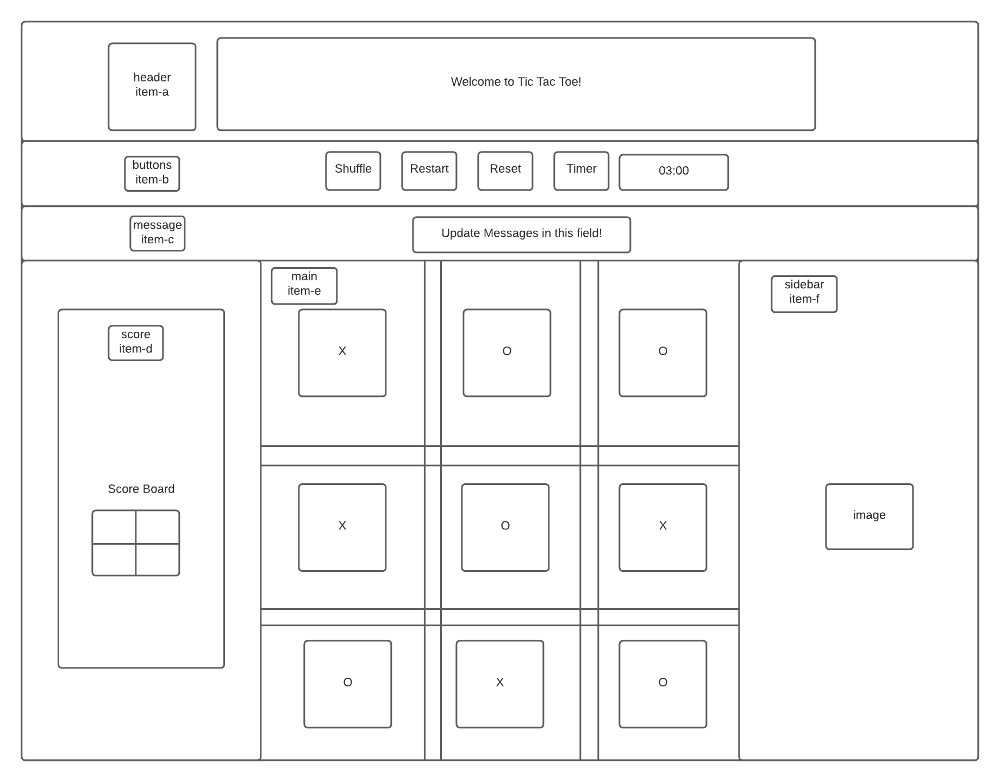

# tic-tac-toe

## Tech Used

-   HTML
-   CSS
-   Javascript

Planning

-Here's the planning

**1. Create index.html for main contents:**

    - Include a title on top.
    - Include buttons for the game: shuffle, restart, reset the entire game, timer.
    - Include time limit box next to the start timer button.
    - Include message updates for players.
    - In 3 bottom colums:
       1. Include score board for x and o.
       2. Include main game board.
       3. Include space for image.

**2. Add style to the contents by adding style.css**

    - Use CSS grid to create class item-a to item-f to make the game webpage responsive.
    - Place grid content into each class.

**3. Make the logic to let the game become responsive by adding Javascript main.js**

    - Add event listeners to all buttons on click.
    - X starts or O starts first? Set up a button which will shuffle X and O when it is clicked and returns either X or O to determine who would start the game.
    - If a X or O has already been clicked, the same box should not respond to or update when another click at the same position occurs.
    - Set a final score and keep track of the scores for both players and update the winner in each single round of game or in the final round.
    - The highest score should be 10. Whoever reaches the highest score first wins the game.
    - Display a winning message when a player wins the single game each time and after the entire game.
    - Display a draw message if nobody wins the game.
    - Display a tie message when X and O reaches the same score of 5.
    - Restart button will clear the game board but keep the scores for player X and O.
    - Reset button will reload the game and also clear the score board.
    - Timer buton will start the timer countdown.
    - Include web audio and API sounds.

**4. Things to improve**

    - Use media queries for the bottom colums to make it look nice when screen shrinks to certain size.
